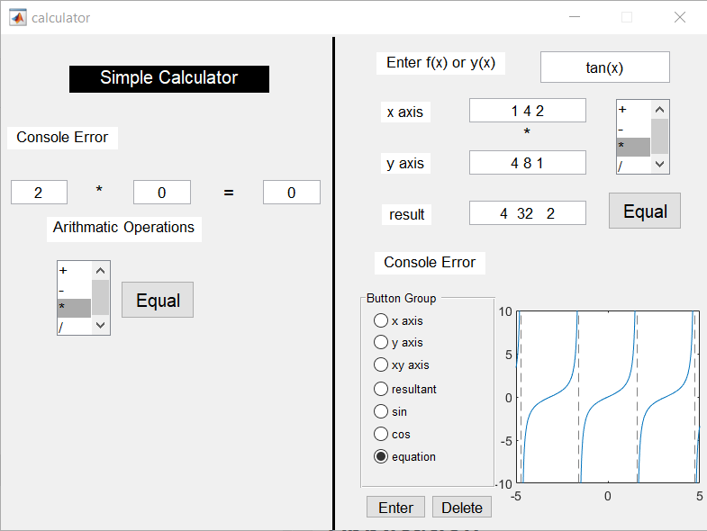

# Calculator

MATLAB calculator using guide in MATLAB.
The calculator includes two main parts.

- Simple arithmatic calculator
- Graphing calculator
## Demo Link
- https://youtu.be/ZVbCbHoj-vA
## Application

