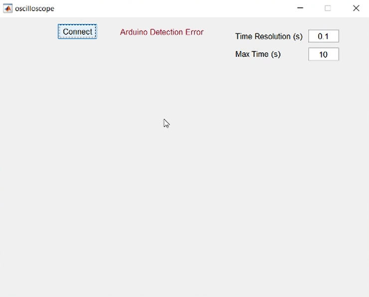

# Oscilloscope using MATLAB and Arduino

Oscilloscope application using MATLAB and  any Arduino board.
The app has 2 modes:

- analog oscilloscope
- digital oscilloscope

You can select you pin number (the one you want to draw its waveform) from each mode corresponding to you arduino board.

You can see the waveform with your desired time step (resolution), and max time difference in the window.

## Demo Link
- https://youtu.be/Rj_PzE-LAqg

## Application Main Window

## Analog Oscilloscope

## Digital Oscilloscope

## Time Resolution Change

