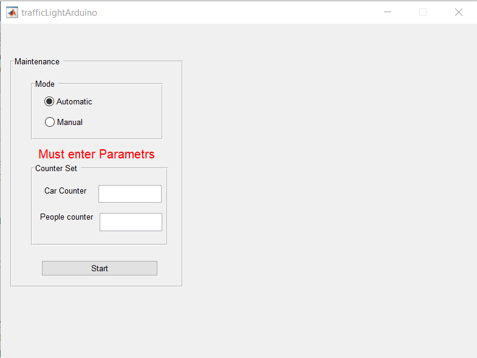
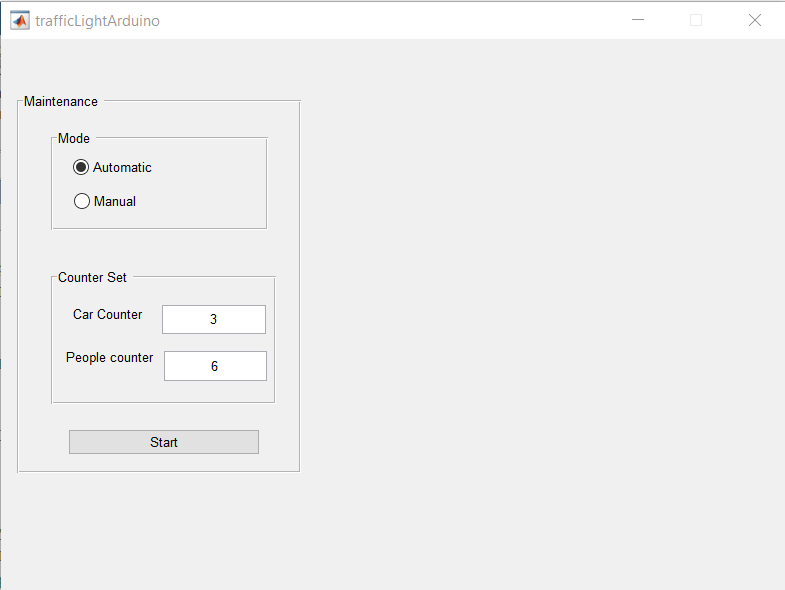
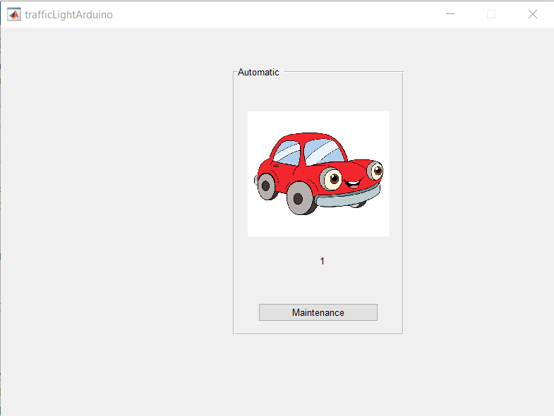
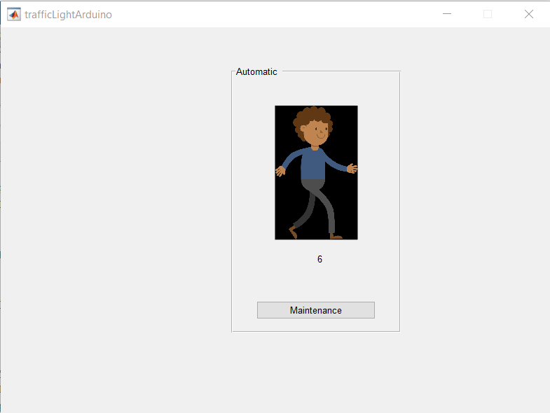
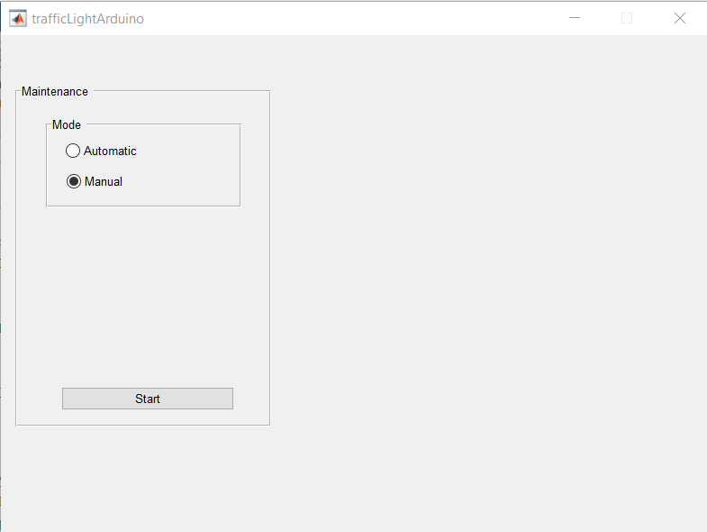
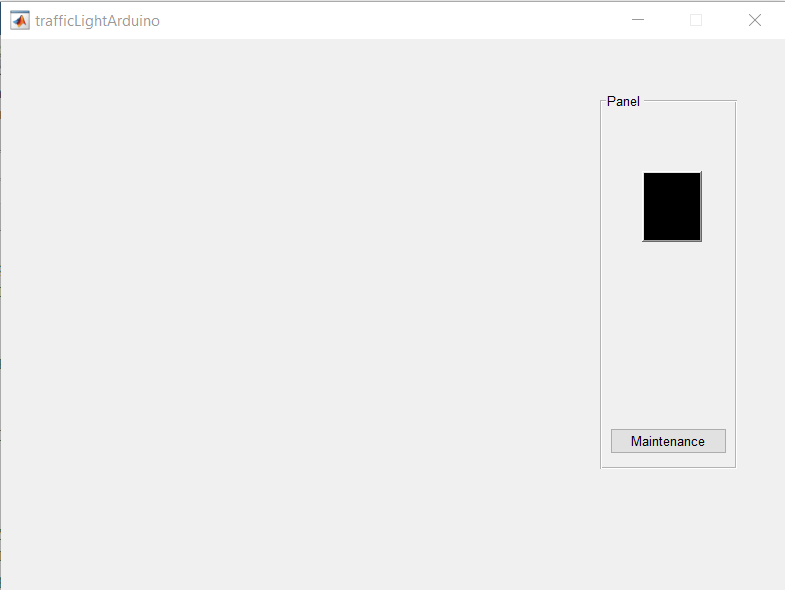

# Traffic Light System

Traffic Light System Using Arduino.
It has 3 modes:
- Maintenance Mode
	to choose to operate in auto or manual mode.
- Automatic Mode
	to start automatic mode with counter set ( counter for cars, counter for people)
- Manual Mode
	to control the traffic manually

## Demo Link
- https://youtu.be/WvXznuwitR8

## Application

