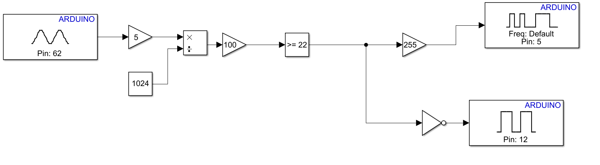

# Fire Alarm System

Fire Alarm System Based on Temperature Sensor, LED, and Buzzer 

- Buzzer on, LED off when temperature is greater than or equal to a threshold value.
- Buzzer off, LED on when temperature is less than a threshold value.
## Demo Link
https://drive.google.com/file/d/11dmiUutN4q5rp2GSyru8RchQtg3eFbRf/view

## Model

